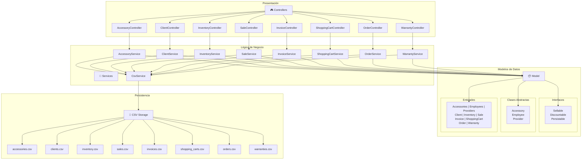
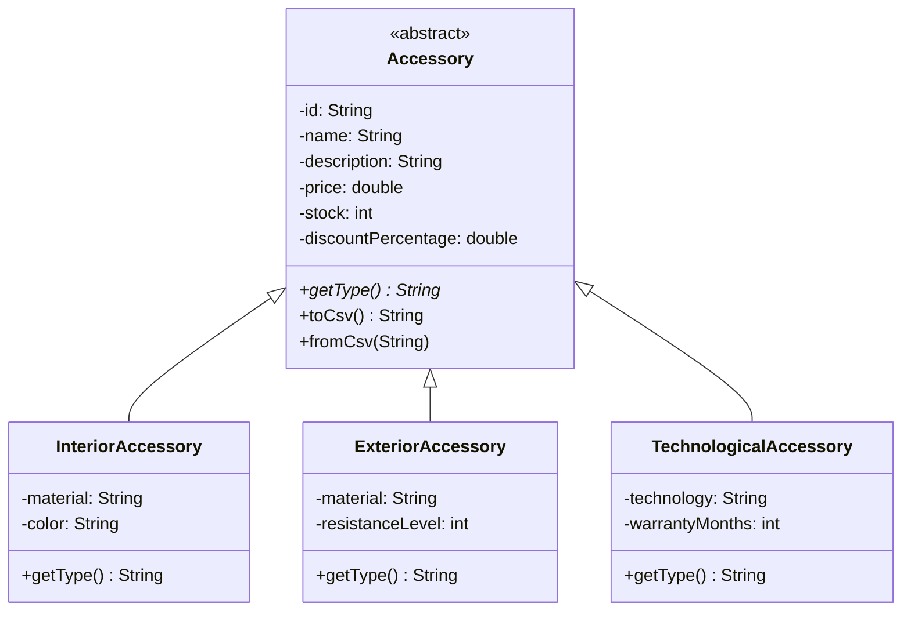
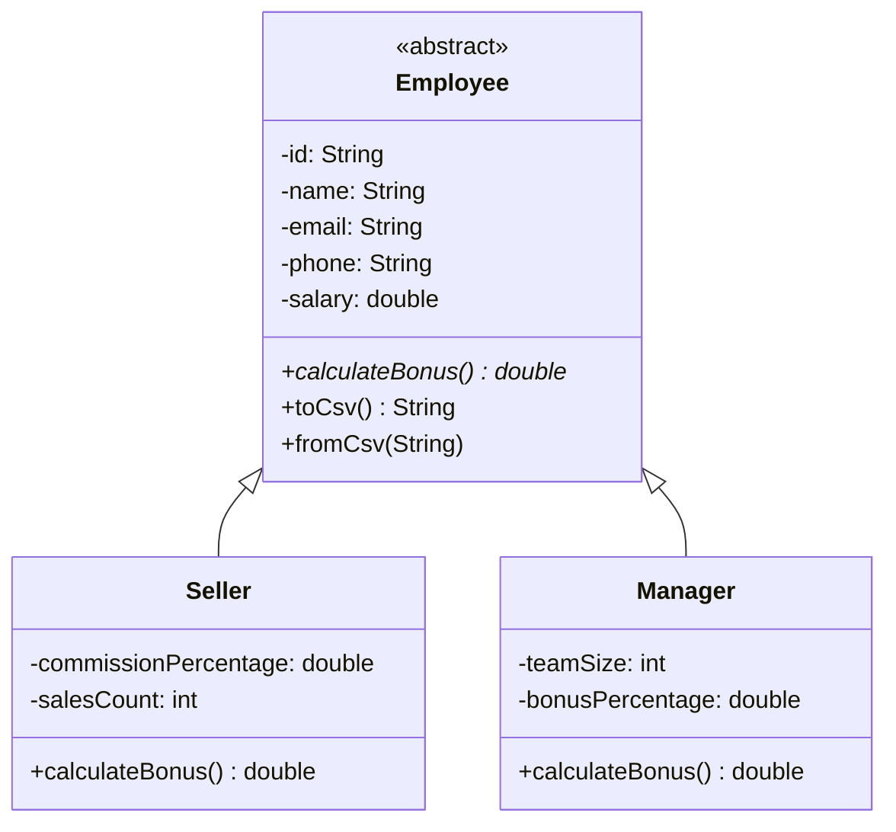
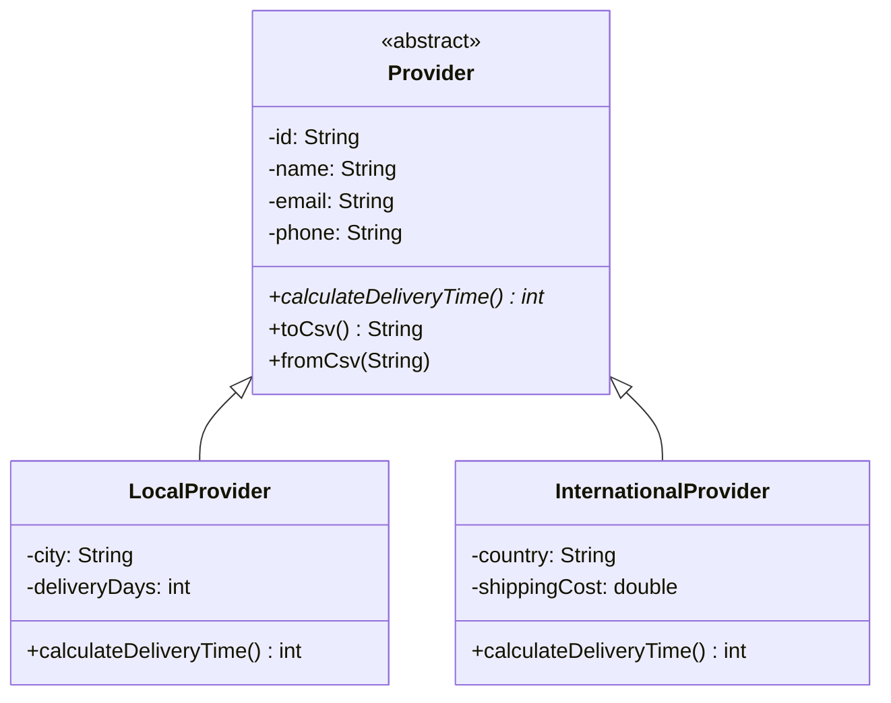
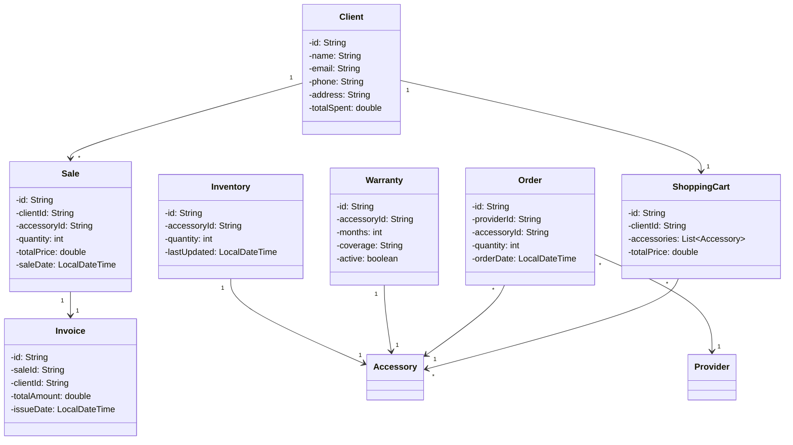
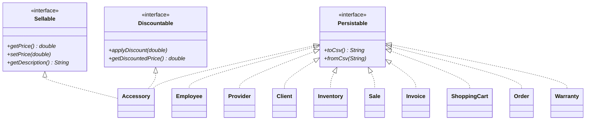
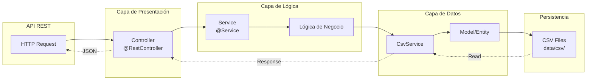
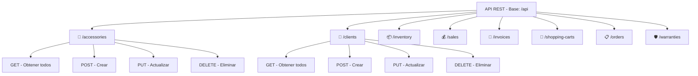
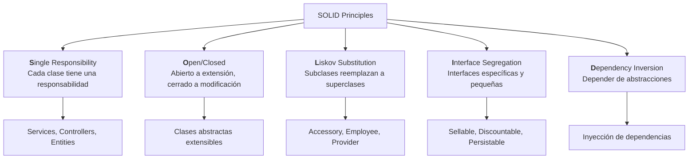

# AutoPlus - Diagrama de Arquitectura UML

## 📊 Mapa Conceptual - Estructura General



---

## 🏗️ Diagrama UML - Jerarquía de Clases

### Accesories (Accesorios)



### Employees (Empleados)



### Providers (Proveedores)



---

## 🔗 Diagrama de Relaciones - Entidades Principales



---

## 📋 Diagrama de Interfaces



---

## 🔄 Flujo de Datos - Arquitectura por Capas



---

## 📊 Matriz de Responsabilidades

| Capa | Componente | Responsabilidad |
|------|-----------|-----------------|
| **Presentación** | Controllers | Recibir requests HTTP, validar entrada, retornar respuestas |
| **Lógica** | Services | Implementar reglas de negocio, orquestar operaciones |
| **Persistencia** | CsvService | Serializar/deserializar datos a/desde CSV |
| **Modelos** | Entities | Representar datos del dominio, implementar interfaces |
| **Almacenamiento** | CSV Files | Persistencia física de datos |

---

## 🎯 Endpoints Disponibles



---

## 🏛️ Principios SOLID Implementados



---

## 📁 Estructura de Directorios

```
AutoPlus/
├── src/main/java/co/edu/umanizales/autoplus/
│   ├── controller/
│   │   ├── AccessoryController.java
│   │   ├── ClientController.java
│   │   ├── InventoryController.java
│   │   ├── SaleController.java
│   │   ├── InvoiceController.java
│   │   ├── ShoppingCartController.java
│   │   ├── OrderController.java
│   │   ├── WarrantyController.java
│   │   └── Prog3Controller.java
│   ├── service/
│   │   ├── AccessoryService.java
│   │   ├── ClientService.java
│   │   ├── InventoryService.java
│   │   ├── SaleService.java
│   │   ├── InvoiceService.java
│   │   ├── ShoppingCartService.java
│   │   ├── OrderService.java
│   │   ├── WarrantyService.java
│   │   └── CsvService.java
│   ├── model/
│   │   ├── abstracts/
│   │   │   ├── Accessory.java
│   │   │   ├── Employee.java
│   │   │   └── Provider.java
│   │   ├── interfaces/
│   │   │   ├── Sellable.java
│   │   │   ├── Discountable.java
│   │   │   └── Persistable.java
│   │   └── entities/
│   │       ├── InteriorAccessory.java
│   │       ├── ExteriorAccessory.java
│   │       ├── TechnologicalAccessory.java
│   │       ├── Seller.java
│   │       ├── Manager.java
│   │       ├── LocalProvider.java
│   │       ├── InternationalProvider.java
│   │       ├── Client.java
│   │       ├── Inventory.java
│   │       ├── Sale.java
│   │       ├── Invoice.java
│   │       ├── ShoppingCart.java
│   │       ├── Order.java
│   │       └── Warranty.java
│   └── AutoPlusApplication.java
├── src/main/resources/
│   ├── application.properties
│   ├── proyecto.md
│   └── ARCHITECTURE_DIAGRAM.md (Este archivo)
├── data/csv/
│   ├── accessories.csv
│   ├── clients.csv
│   ├── inventory.csv
│   ├── sales.csv
│   ├── invoices.csv
│   ├── shopping_carts.csv
│   ├── orders.csv
│   └── warranties.csv
├── pom.xml
└── README.md
```

---

## 🔑 Conceptos Clave

### Herencia
- **Accessory** → InteriorAccessory, ExteriorAccessory, TechnologicalAccessory
- **Employee** → Seller, Manager
- **Provider** → LocalProvider, InternationalProvider

### Polimorfismo
- Método `getType()` implementado diferente en cada tipo de accesorio
- Método `calculateBonus()` implementado diferente en Seller y Manager
- Método `calculateDeliveryTime()` implementado diferente en proveedores

### Encapsulamiento
- Atributos privados con getters/setters automáticos (Lombok @Data)
- Acceso controlado a datos sensibles

### Interfaces
- **Sellable**: Define comportamiento de venta (precio, descripción)
- **Discountable**: Define comportamiento de descuentos
- **Persistable**: Define serialización a CSV

### Composición
- Invoice contiene datos de Sale
- ShoppingCart contiene múltiples Accessories
- Order relaciona Provider con Accessory

---

## 🚀 Tecnologías

- **Java 23+** - Lenguaje de programación
- **Spring Boot 3.x** - Framework web
- **Lombok** - Reducción de boilerplate
- **Maven** - Gestor de dependencias
- **CSV** - Persistencia de datos

---

**Última actualización:** 2025-11-04
**Autor:** Carlos Alberto Loaiza Guerrero
